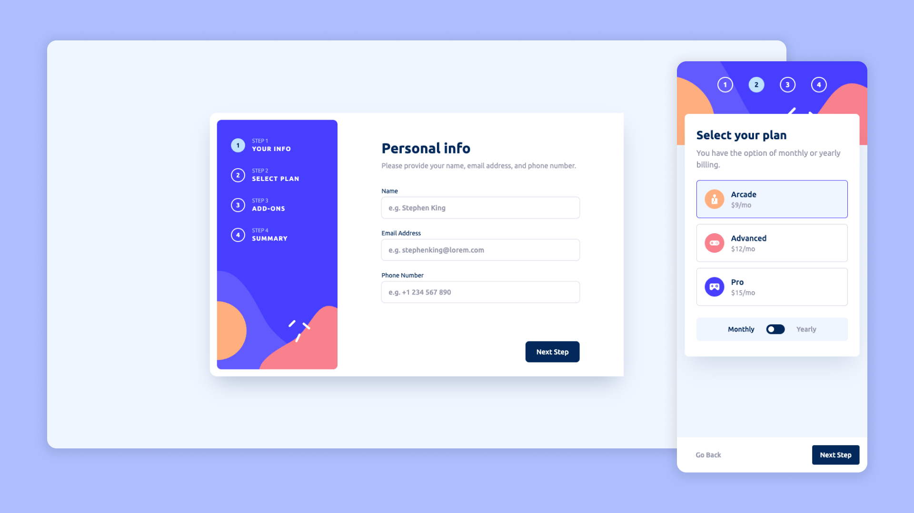

# Frontend Mentor - Recipe page solution

This is a solution to the [Multi-step form challenge on Frontend Mentor](https://www.frontendmentor.io/challenges/multistep-form-YVAnSdqQBJ). Frontend Mentor challenges help you improve your coding skills by building realistic projects. 

The most complete challenge project I've done from Frontend Mentor, lots of screens, active states and mobile adaptations, the first one where I actually needed to use Javascript to do some logic and a very useful one, are really common real life forms that are multi-step.
I chose to work on this project as a paid one that might grow and need maintenance at some point, making it as organized as I could and using tools that could be used to get continuous updates. Working on the multi-step logic was really good, making it easy to understand and implement.
Like the other projects, I used Figma to help me with the sizes and distances, as I only used the images provided, some sizes may not match 100%.

## Overview

### Screenshot

### Links

- Solution URL: [Solution code here](https://github.com/iranadryan/fe-mentor-multi-step-form)
- Live Site URL: [See the results here](https://iranadryan.github.io/fe-mentor-multi-step-form)

### Built with

- HTML
- ContextAPI
- [Vite](https://vitejs.dev) - JS Build Tool
- [React](https://reactjs.org) - JS library
- [Tailwindcss](https://tailwindcss.com) - For styles
- [Zod](https://zod.dev/) - Validation library

## Author

- Frontend Mentor - [@ianadryan](https://www.frontendmentor.io/profile/iranadryan)
- LinkedIn - [iranbatista](https://www.linkedin.com/in/iranbatista)

